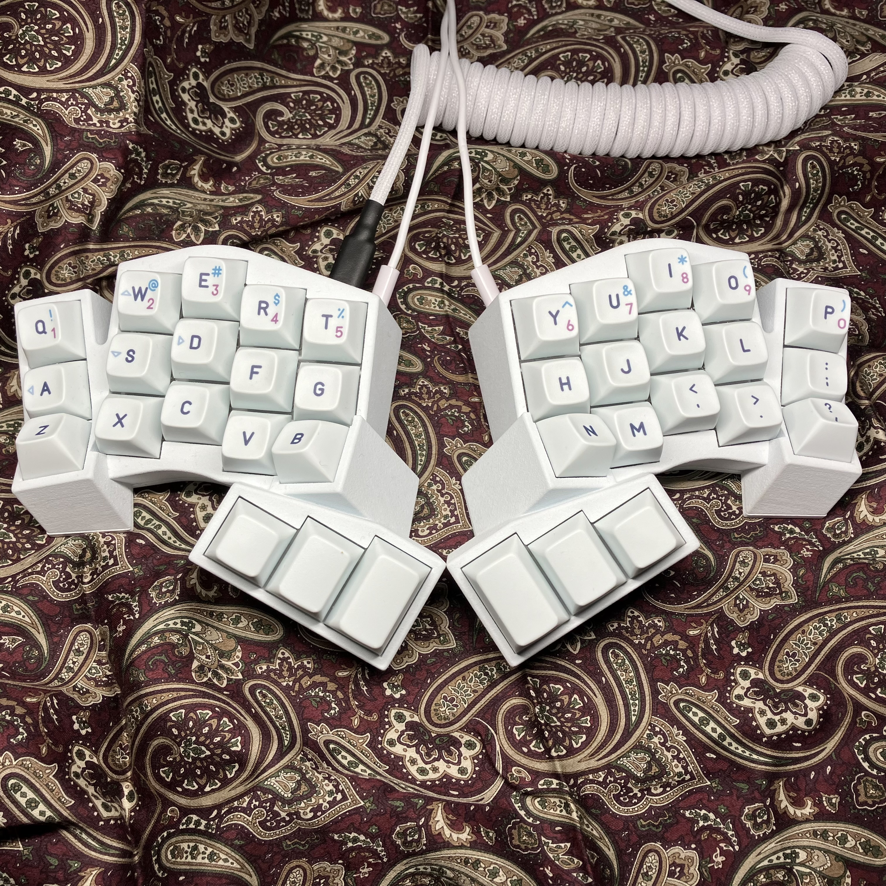
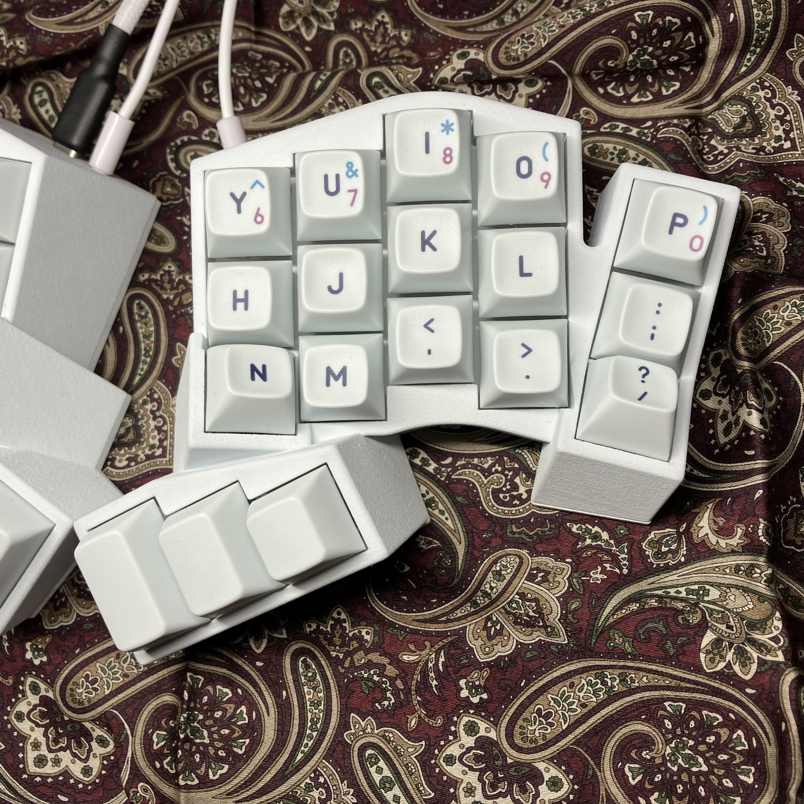
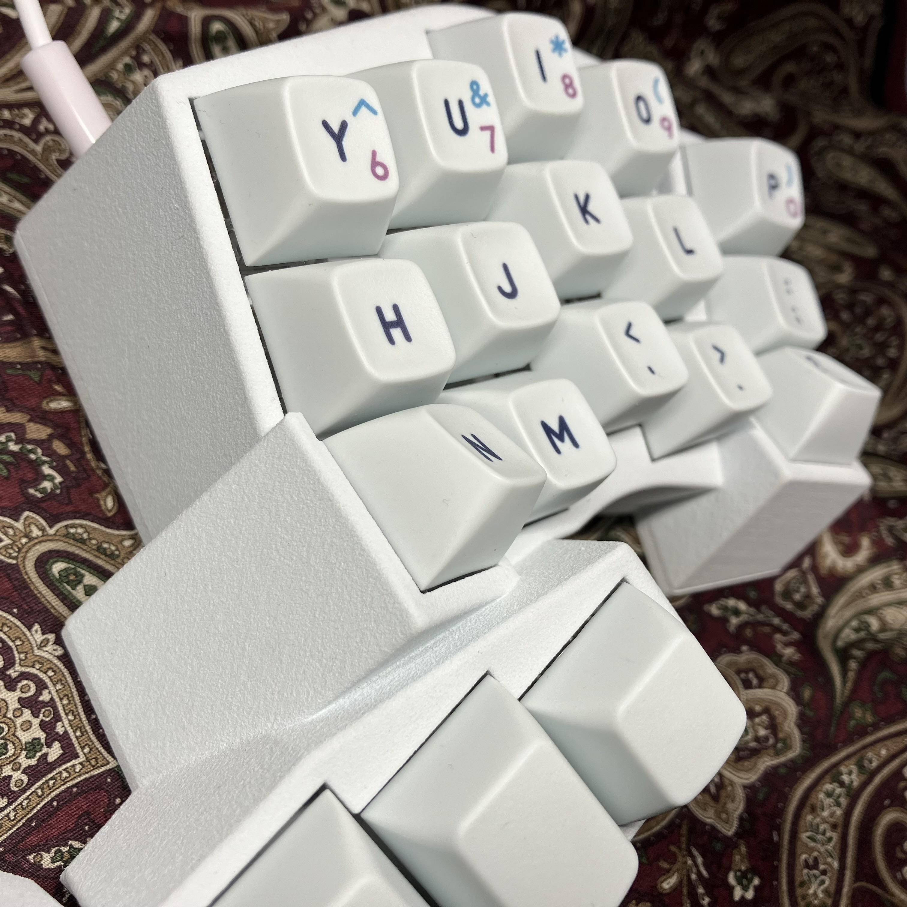
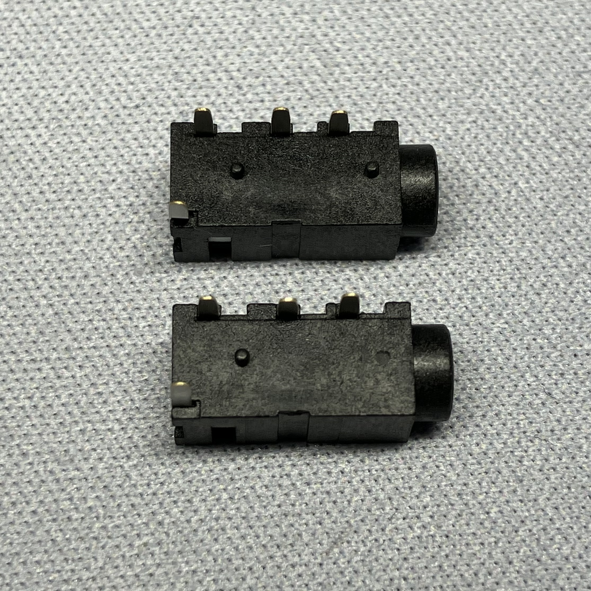

# SANGAKU

このキーボードは[ナズナ](https://twitter.com/naznaz_inv)(作成者)が設計した36 Keyキーボードのリポジトリです。リポジトリには本キーボードの編集可能な[Fusion 360モデルデータ](sangaku.f3d)、ビルドに必要なパーツ表を記載しています。
ビルド方法などについては記載していません。適宜行ってください。

本[README.md](README.md)にはアフェリエイトとかなんかそういうリンクはないので~~安心して~~クリックしてください。

## 特徴

- 全36Key で構成されるキーボード
- キーの大部分が平面配列ベースの立体配列とすることにより運指の自由度の高さを確保
- 小指の負担を軽減するオフセット角と最終行の逆チルト
- B,Nを傾斜させることによる人差し指関節への負担の軽減
- 手首が水平でリラックスできるチルト 15°、テント7°の傾斜
- 摩耗パーツのリプレースが比較的容易な設計

</td></td>

## ビルドに必要なソフトウェア/技能・知識

### ソフトウェア
- Fusion360 Free以上

### 技能/知識
- Fusion360で任意のモデルを鏡面対象にできる技能
- 任意のモデルを3Dプリントできる技能
- 熱可塑性樹脂に熱圧入インサートナットを圧入できる技能
- はんだ付けできる技能
- qmk/vialに関する技能・知見

## 必要なもの

- 作成者はAmazon/遊舎工房/TALPKEYBOARD/オヤイデ電気で入手しました。同等品であれば問題ないかと思います。

### 非汎用部品

- [3Dプリント済みモデル](sangaku.f3d)(トップ) 左および右
- [3Dプリント済みモデル](sangaku.f3d)(ボトム) 左および右
- [1U用PCB](https://talpkeyboard.net/items/5e7ed998e20b0476ebdcb9f1)([SU120](https://github.com/e3w2q/su120-keyboard)) 36個

### 汎用部品

- M1.4 * 5 mm タッピングビス 18 * 2 * 4個 = 144個
- M3 * 5 mm フラットラウンド頭ネジ 10 * 2個 = 20個
- M3 (長さ 5 mm * 外径 5 mm) 熱圧入インサートナット 10 * 2個 = 20個
- Cherry MX互換スイッチ 18 * 2個 = 36個
- [Cherry MX互換キーキャップセット](https://drop.com/buy/drop-biip-mt3-operator-keycap-set) 1セット
- [ホットスワップソケット](https://shop.yushakobo.jp/products/a01ps) (MX用Kailh Switch Socket) 18 * 2個 = 36個
- ダイオード 18 * 2個 = 36個
- 配線 概ね5 m
- [ProMicro](https://shop.yushakobo.jp/products/3905) (基板長辺35 mmのUSB-Cのもの) 2個
- [4極オーディオジャック](https://shop.yushakobo.jp/products/a0800tr-01-1) PJ-320A 2個

### 部品に関する注意/補足事項

#### ケースについて

- [モデルデータ](sangaku.f3d)には右手用のモデルしか入っていません。左手用のモデルは鏡面反転させて左手用のモデルとしてください。
- 熱圧入インサートナットを使用するため、ABSやナイロン等の熱可塑性樹脂である必要があります。
- 本ケースの公差は前述のDMM 3DプリントサービスのMJF PA12W基準で設定しています。適宜使用するプリントサービス、プリンターに応じて設計変更を行ってください。
- 本モデルは作成者の作製したSANGAKUの反省をもとに多少改変しているため、**本モデルの出力実績はありません**。慎重に確認したため不具合はないかと思いますがご留意ください。

#### M1.4 * 5 mm タッピングビスに関して

- 1U用PCBとケースの固定に使用します。モデルの造形精度によってはタッピングビスがスイッチ側にはみ出してしまい、スイッチと干渉してしまいます。ですので、個人的には1U用PCBとケースの固定にはエポキシなどの接着剤による固定、または非ホットスワップとしてビルドすることをお勧めします。
- 一部タッピングビスのねじ込みが困難、または不可能な箇所があります。そのような箇所は1キーあたりに必要なねじ止め箇所4箇所のうち最大1箇所になるように設計しています。

#### キーキャップセットに関して

- サムクラスタのサイズは小さいほうから1U、1.25U、1.50Uです。US配列のキーキャップセットであれば揃うかと思いますが特殊な組み合わせなのでご注意ください。作成者は[DROP + BIIP MT3 OPERATOR KEYCAP SET](https://drop.com/buy/drop-biip-mt3-operator-keycap-set)のNomad Kitを使用しています。

#### 配線に関して

- 手配線を行う都合上シリコン被膜、架橋ポリエチレン被膜等の高耐熱被膜をお勧めします。作成者はシリコン被膜のものを使用しました。

#### 4極オーディオジャック PJ-320Aについて

- 設計の都合上、画像のように差込口側の突起を切り落とす必要があります。

<td></td>

## vialのサンプル

~~動けばいいや精神でファームを書いたので~~[vial.json](vial.json)のみ添付しています。
ほか必要であれば[作成者](https://twitter.com/naznaz_inv)に問い合わせてください。

## 影響を受けたプロジェクト

本キーボードを設計するにあたり影響を受けたプロジェクトです。

[Chortyl Keyboard](https://github.com/jdart/chortyl)

[SpUnLy58 Keyboard](https://github.com/Giraffasax/SpUnLy58)

[Cygnus Keyboard](https://github.com/juhakaup/keyboards/tree/main/Cygnus%20v1.0)

## ライセンス

- WIP
- 個人利用の範囲であれば改変自由です。

## 最後に

- **データ、パーツの整合性、適合性等は作成者が確認していますが、各個人でも再確認してください。**
- 不明点、ご指摘などあれば[作成者](https://twitter.com/naznaz_inv)までご連絡ください。
